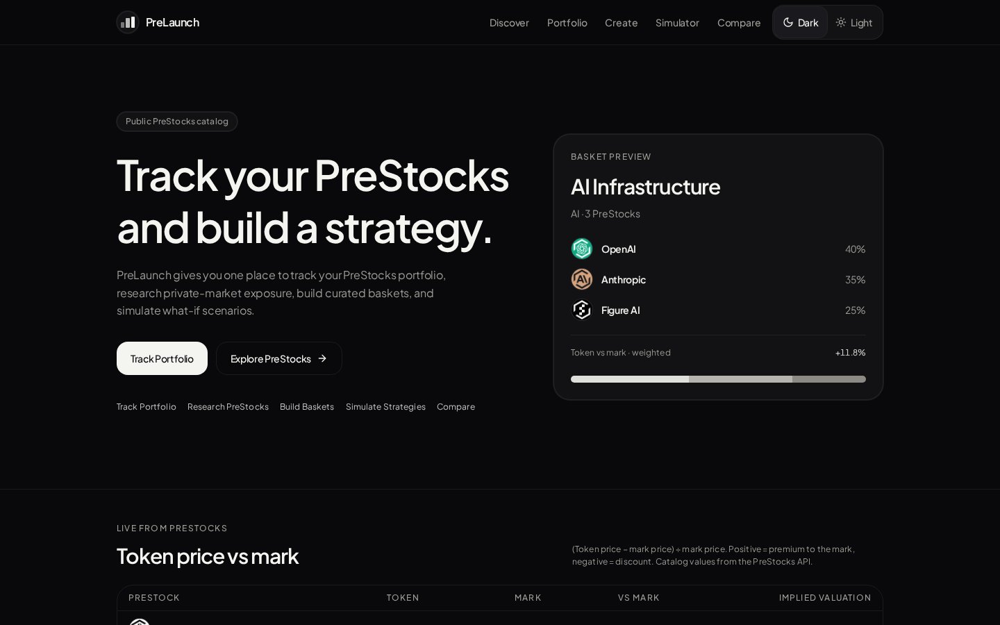
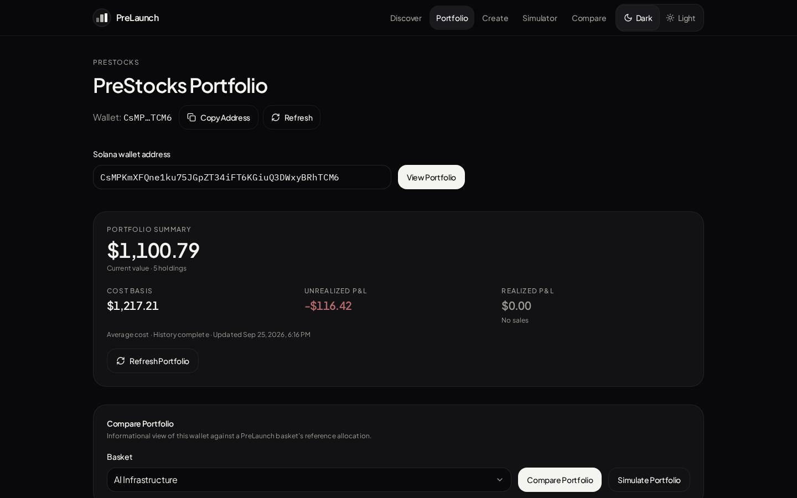
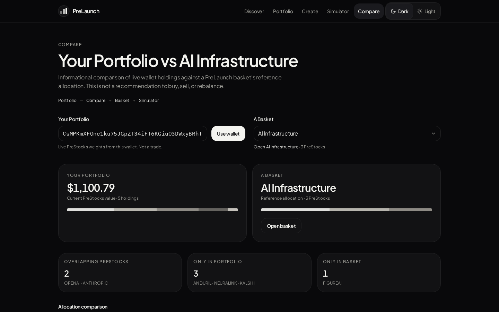
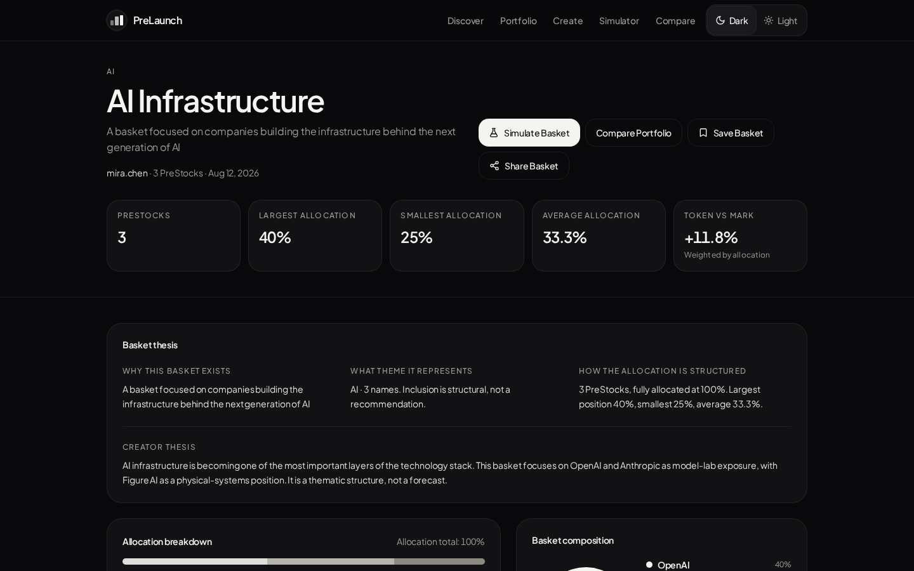
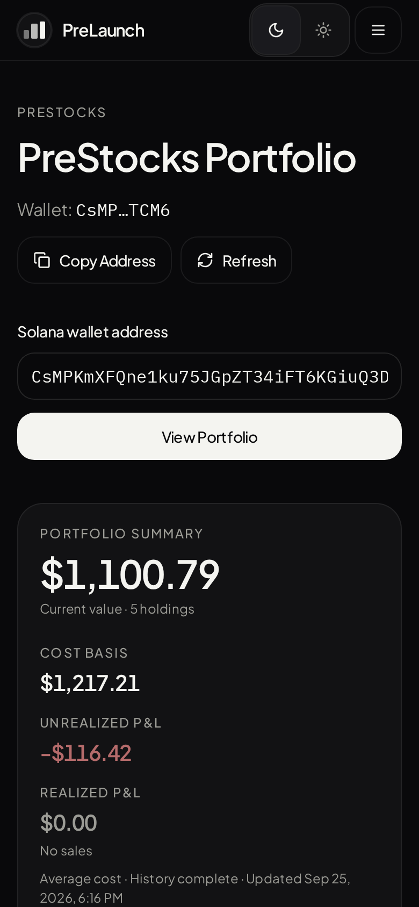

# PreLaunch

**A read-only portfolio and strategy layer for [PreStocks](https://prestocks.com)** — tokenized, pre-IPO economic exposure on Solana.

**Demo:** https://pre-launched.vercel.app

**Try it:** open [/portfolio](https://pre-launched.vercel.app/portfolio) and click **Try a sample wallet** — a public Solana wallet that has bought Anduril and Neuralink PreStocks with USDC in small recurring buys since June 2026, with average-cost basis and unrealized P&L resolved from its on-chain history.

| Home — live token price vs mark | Portfolio — sample wallet with cost basis |
| --- | --- |
|  |  |
| **Compare — sample wallet vs AI Infrastructure** | **Basket — weighted token vs mark** |
|  |  |

<p></p>

Silent demo (38 s, home → sample wallet portfolio → compare → simulator): [docs/screenshots/demo.mp4](docs/screenshots/demo.mp4)

Screenshots were captured from the live site on Sep 25, 2026; prices and P&L change with the market.

PreLaunch lets you discover and research PreStocks, track the PreStocks held by any Solana wallet, see value / allocation / cost basis where on-chain history supports it, build allocation-based PreStock baskets, compare a wallet against a basket, and run explicitly hypothetical what-if scenarios.

> **Read-only by design.** PreLaunch never connects a wallet, never asks for a private key or seed phrase, never signs or sends a transaction, and has no trading, swap, order, or custody functionality. Publishing a basket publishes a _strategy idea inside PreLaunch_ — it does not create a token, liquidity, an order, or a blockchain transaction.

---

## Contents

- [Features](#features)
- [Architecture](#architecture)
- [Stack](#stack)
- [Portfolio data flow](#portfolio-data-flow)
- [PreStocks API](#prestocks-api)
- [Helius integration and Solana RPC fallback](#helius-integration-and-solana-rpc-fallback)
- [Asset matching](#asset-matching)
- [Cost-basis methodology](#cost-basis-methodology)
- [Baskets](#baskets)
- [Portfolio vs basket comparison](#portfolio-vs-basket-comparison)
- [Strategy simulator](#strategy-simulator)
- [Security model](#security-model)
- [Limitations](#limitations)
- [Local development](#local-development)
- [Testing and CI](#testing-and-ci)
- [Hosting](#hosting)
- [Repository structure](#repository-structure)

Deeper docs: [`docs/architecture.md`](docs/architecture.md) · [`docs/data-model.md`](docs/data-model.md) · [`CONTRIBUTING.md`](CONTRIBUTING.md) · [`SECURITY.md`](SECURITY.md)

---

## Features

| Area             | Route                        | What it does                                                                                                                                                                         |
| ---------------- | ---------------------------- | ------------------------------------------------------------------------------------------------------------------------------------------------------------------------------------ |
| Home             | `/`                          | Pitch, featured baskets, and a compact live table of every PreStock's token price vs mark price (premium/discount) and implied valuation.                                            |
| Discover         | `/discover`                  | Browse the live PreStocks catalog and baskets; search by name, symbol, thesis, creator; filter by category and constituent count.                                                    |
| Research         | `/research/$id`              | Catalog fields for one PreStock: token price, mark price, token-vs-mark spread, supply, implied and mark valuation, link to the PreStocks page, related baskets.                     |
| Portfolio        | `/portfolio?wallet=…`        | Holdings, quantity, current price, value, allocation, average-cost basis, unrealized and realized P&L — each shown only when the data supports it. "Try a sample wallet" fills a real public wallet. |
| Create / publish | `/create`                    | Select ≥ 2 PreStocks, set allocations that total 100%, write a thesis, publish to this browser.                                                                                      |
| Basket           | `/basket/$id`                | Thesis, allocation breakdown, allocation-weighted token-vs-mark premium, catalog data per constituent (token price, vs mark, implied valuation), embedded simulator.                |
| Compare          | `/compare?wallet=…&basket=…` | Wallet weights vs a basket's reference weights: overlap, portfolio-only, basket-only, signed difference. Also offers the sample wallet.                                              |
| Simulator        | `/simulator`                 | Per-position hypothetical % moves on a basket or on a wallet's current weights.                                                                                                      |
| Saved / creators | `/saved`, `/creator/$id`     | Baskets saved in this browser; baskets grouped by creator name.                                                                                                                      |
| JSON API         | `GET /api/portfolio/$wallet` | The same portfolio snapshot as JSON (`Cache-Control: no-store`).                                                                                                                     |

## Architecture

PreLaunch is a single [TanStack Start](https://tanstack.com/start) app (React 19, SSR) deployed as a Vercel function via Nitro.

```
Browser (React)                         Server (TanStack Start / Nitro)                 External
─────────────────                       ────────────────────────────────                ────────
routes/* ──useCatalog()──▶ root loader ─▶ getPreStocksFn ─▶ prestocks-api.ts ───────────▶ prestocks.com/api/prestocks
routes/portfolio ─────────▶ getPortfolioFn (POST) ─▶ portfolio-load.server.ts
                                              │   ├─ fetchPreStocks()     (catalog, 60 s cache)
                                              │   ├─ helius.server.ts     ─ DAS balances, per-token-account ─▶ mainnet.helius-rpc.com
                                              │   │    │                    signatures + Enhanced Tx parse
                                              │   │    └─ fallback ─▶ solana-rpc.server.ts ──────────▶ public Solana RPC
                                              │   ├─ token-accounts.ts    (PreStock token accounts, ATA derivation, budget)
                                              │   ├─ helius-history.ts    (parse tx → PreStock movements, fee-aware)
                                              │   └─ portfolio.ts + cost-basis.ts (pure snapshot + average cost)
                                              ▼
                                         PortfolioResponse
localStorage: baskets, drafts, saves, local view counts   (no server-side user data)
```

Key properties:

- **Server-only secrets.** Everything touching `HELIUS_API_KEY` lives in `*.server.ts` modules that throw if imported in a browser and are loaded with dynamic `import()` from server functions.
- **Pure core.** Matching, cost basis, comparison, allocation validation and simulation are pure functions in `src/lib/` with unit tests; the routes are presentation.
- **No server-side persistence of PreLaunch data.** Baskets, drafts and saves are stored in `localStorage`; the portfolio snapshot is cached in `sessionStorage` for the simulator/compare pages.

See [`docs/architecture.md`](docs/architecture.md) for module-level detail.

## Stack

- React 19, TanStack Start / Router, TypeScript (strict)
- Tailwind CSS v4, Radix UI primitives, lucide icons, Recharts (allocation donut only)
- Nitro (Vercel preset) for the server bundle; Grok app-builder hosting wiring (see [Hosting](#hosting))
- PreStocks public catalog API
- Optional [Helius](https://www.helius.dev/) (DAS + Enhanced Transactions), public Solana JSON-RPC fallback
- Tests: Node's built-in test runner with `--experimental-strip-types` (no extra test framework)
- ESLint 9 (typescript-eslint, react-hooks), Prettier

## Portfolio data flow

`loadPortfolio(wallet)` in `src/lib/portfolio-load.server.ts`:

1. **Validate** the address: base58, decodes to exactly 32 bytes (`src/lib/solana-address.ts`). Invalid input returns `INVALID_WALLET` without any network call.
2. **Catalog**: `fetchPreStocks()` (60 s in-memory cache). Failure → `PRESTOCKS_REQUEST_FAILED`; nothing is guessed.
3. **Balances**: `fetchWalletFungibles(wallet, { mints })` — Helius first when configured, otherwise public RPC (see below). 30 s per-wallet cache.
4. **History**: `fetchWalletHistory(wallet, { mints })` reads history **per PreStock token account**, not the wallet's whole transaction history (see [PreStock token-account history](#prestock-token-account-history)), then `parsePreStockTransactions()` turns it into PreStock movements. Mints whose history could not be read completely are returned as `truncatedMints`. History failure does _not_ fail the request; it sets `historyStatus: "unavailable"` so holdings still render while cost basis is shown as unavailable.
5. **Snapshot**: `buildPortfolioSnapshot()` (pure) matches balances to the catalog by mint, prices them, computes allocation, runs average cost (withholding cost basis for any mint in `truncatedMints`), and assembles totals.

Every derived number is either computed from real inputs or `null`:

| Field           | Source                                   | `null` / partial when                                             |
| --------------- | ---------------------------------------- | ----------------------------------------------------------------- |
| `quantity`      | on-chain token amount (decimals applied) | —                                                                 |
| `tokenPrice`    | catalog `tokenPrice`                     | catalog price missing, non-finite or ≤ 0                          |
| `value`         | `quantity × tokenPrice`                  | price unavailable                                                 |
| `allocation`    | `value ÷ Σ priced values`                | price unavailable                                                 |
| `totalValue`    | Σ priced values                          | `unpricedCount > 0` → UI labels the total _Partial_               |
| `costBasis`     | average cost of verified acquisitions    | that mint's history is missing/truncated, or includes unknown-cost tokens |
| `unrealizedPnl` | `value − costBasis`                      | either side unavailable                                           |
| `realizedPnl`   | sales matched to average cost            | any sale lacks proceeds or fully-known cost; history not complete |

The UI (`src/routes/portfolio.tsx`) marks totals with unpriced holdings as **Partial**. The summary shows a figure only when data supports it (`summaryFigures()`, pure): a complete total when every position is covered, otherwise the sum over verified positions labelled **Partial · n of m positions**. Metrics with no supporting data collapse into one muted "Not available: …" line with the reason from `summaryNotes()` (e.g. "0 of 2 verified", "needs full history"), instead of large "Unavailable" boxes. Per-position cells in the holdings table still read _Unavailable_.

## PreStocks API

- Endpoint: `GET https://prestocks.com/api/prestocks` (public, JSON array).
- Consumed fields: `name`, `symbol`, `description`, `image`, `external_url`, `contract_address`, `tokenPrice`, `markPrice`, `markValuation`, `impliedValuation`, `supply`.
- `normalizePreStock()` upper-cases the symbol (used as the internal id), derives a display name, and assigns a PreLaunch-only category from a static symbol map (`src/lib/prestock-meta.ts`) because the API has no categories.
- Rows without a string `name` and `symbol` are dropped; an empty or non-array response is an error.
- PreLaunch shows only what the catalog returns — no additional or unrelated assets.

## Helius integration and Solana RPC fallback

`src/lib/helius.server.ts` (server-only):

| Step     | With `HELIUS_API_KEY`                                                                                                                                     | Without it / on Helius failure                                                                                                       |
| -------- | --------------------------------------------------------------------------------------------------------------------------------------------------------- | ------------------------------------------------------------------------------------------------------------------------------------ |
| Balances | DAS `getAssetsByOwner` (fungibles, paged, ≤ 5 × 1000), falling back to `searchAssets` (`tokenType: fungible`)                                             | `getTokenAccountsByOwner` for the Token-2022 program on public RPC, filtered to catalog mints                                        |
| Token accounts | `getTokenAccountsByOwner` (Token-2022, jsonParsed, any balance) on Helius RPC                                                                     | Same call on public RPC                                                                                                              |
| History  | Per PreStock token account: `getSignaturesForAddress` (≤ 1,000), then Enhanced Transactions `POST /v0/transactions` (batches of 100, 429 retry/back-off) | Per token account: `getSignaturesForAddress` (≤ 100) + `getTransaction` (jsonParsed, ≤ 80 in total), converted by `fromParsedRpcTransaction()` |

Public RPC (`src/lib/solana-rpc.server.ts`) rotates between `api.mainnet-beta.solana.com` and `solana-rpc.publicnode.com`, uses a 12 s timeout, and retries rate-limited responses up to 3 times with linear back-off. Helius auth errors (401/403) surface as `HELIUS_AUTH_ERROR`; any `api-key=` fragment in upstream error text is redacted before it can reach a response.

History is marked **partial** per mint when a limit is hit, so that mint's cost basis is never reported on a truncated history. Helius RPC calls retry HTTP 429 with back-off before any fallback.

## PreStock token-account history

Busy wallets (bots, market makers, aggregator users) can have thousands of unrelated transactions, which used to push PreStock trades past a wallet-wide cap. History is now scoped to the accounts that can actually hold PreStocks (`src/lib/token-accounts.ts`, `src/lib/helius.server.ts`):

1. **Accounts**: every open Token-2022 account the wallet owns for a catalog mint (zero-balance accounts included), plus the **derived associated token account** for each catalog mint (`associatedTokenAddress()`, a pure `findProgramAddress` with an ed25519 on-curve check). The derived ATA picks up history of a closed account, e.g. a fully exited position, so realized P&L is not silently missed.
2. **Signatures**: `getSignaturesForAddress` per account (≤ 1,000). Accounts that never existed return nothing and cost nothing further.
3. **Budget**: `selectSignatures()` parses at most 1,500 unique signatures per wallet, smallest accounts first. An account over 1,000 signatures or over the remaining budget contributes only its newest 100 (for the transaction list) and its mint is marked truncated → no cost basis for that position.
4. **Parse**: Helius Enhanced Transactions in batches of 100; duplicates across accounts are dropped (`mergeBySignature()`).

Public-RPC fallback follows the same account list with tighter limits (100 signatures per account, 80 parsed transactions in total).

## Asset matching

Wallet tokens are matched to PreStocks **only by exact mint / `contract_address`** (`matchPreStockHoldings`, `parsePreStockTransactions`):

- Addresses are trimmed but never case-folded (base58 is case-sensitive).
- Names, symbols and tickers are never used to match on-chain assets.
- Multiple token accounts of the same mint are summed.
- Tokens whose mint is not in the catalog are ignored.

## Cost-basis methodology

Method: **average cost** (`src/lib/cost-basis.ts`), per mint, processed chronologically.

Transaction classification (`src/lib/helius-history.ts`):

Movements are measured from **balance deltas** (`accountData[].tokenBalanceChanges` in Helius Enhanced Transactions; pre/post token balances on public RPC), not from transfer instructions. PreStock mints use the Token-2022 **transfer-fee** extension (observed on mainnet: 1%, then 3%), so the transfer amount overstates what a buyer receives; using transfer amounts made on-chain quantity never match history and cost basis never resolve.

- **Buy / Acquisition** — for this wallet, in one transaction: exactly one PreStock nets in, USDC/USDT (the only assets valued, at $1) nets out, every other token leg nets to zero (e.g. a wrapped-SOL hop inside an aggregator route), and native SOL spent is at most 0.02 SOL (fees and account rent). Cost = stablecoins paid, so the transfer fee is part of cost. The Helius type label is not required — aggregator routes are often labelled `TRANSFER` or `UNKNOWN`.
- **Sell / Disposal** — the mirror image: exactly one PreStock nets out, stablecoins net in, no other net legs, and at most 0.02 SOL received. Proceeds = stablecoins received.
- **Transfer in / out** — everything else, including trades paid in SOL or other tokens and multi-PreStock swaps (USD cannot be attributed honestly without a historical price source).

Accounting rules:

- Only priced acquisitions enter the average. **Incoming transfers are not buys**; they add _unknown-cost_ quantity.
- **Outgoing transfers are not sales**; they reduce quantity (unknown-cost first) and realize nothing.
- A sale realizes P&L only if proceeds are known _and_ the sold quantity is fully covered by known-cost inventory. Otherwise realized P&L becomes unavailable.
- A position's cost basis is reported only when known-cost quantity matches the current on-chain quantity (tolerance 1e-6 relative) with no unknown-cost tokens.
- Portfolio totals require every holding to be covered and history status `ok`.
- **The current catalog price is never used as a historical purchase price.**

## Baskets

- Model: `Basket { id, name, category, creator, source: "catalog" | "local", constituents: { preStockId, allocation }[], thesis, … }` — see [`docs/data-model.md`](docs/data-model.md).
- Seed strategies live in `src/data/mock-baskets.ts` (source `catalog`; example creator handles; metrics start at 0).
- User baskets are created in `/create`, validated by `validateAllocations()` (`src/lib/basket-validation.ts`), and saved to `localStorage` (`prelaunch.baskets.v1`) by `baskets.publish()`.
- Allocation rules: ≥ 2 PreStocks; no empty or duplicate ids (after alias canonicalization); every allocation finite and > 0; total within **±0.05** of 100% (absorbs float noise like 33.3 + 33.3 + 33.4).
- **Publishing publishes a strategy idea inside PreLaunch only.** It creates no token, liquidity, order, or blockchain transaction.
- Views and saves are counted locally in this browser; they are not network-wide statistics.
- **Token vs mark premium** (`src/lib/premium.ts`): per PreStock, `(tokenPrice − markPrice) ÷ markPrice × 100` from the catalog (null unless both prices are positive). Per basket, the allocation-weighted average `Σ(wᵢ × premiumᵢ) ÷ Σwᵢ` over constituents with both prices, with "n of m" shown when some are missing. Shown on basket cards, the basket header and allocation table, the home hero, and the home token-vs-mark table. Neutral styling; it is a catalog observation, not a signal.
- Share links work for catalog baskets. Browser-published baskets exist only in the publishing browser, so the share button explains that instead of producing a dead link.

## Portfolio vs basket comparison

`comparePortfolioToBasket()` (`src/lib/compare.ts`):

- Portfolio weight = position value ÷ total priced value; basket weight = constituent allocation.
- Rows are classified `both`, `portfolio` (held, not in basket) or `basket` (in basket, not held); `difference = portfolio% − basket%`.
- Plain-language insights restate those numbers. There is no rebalancing advice, no basket NAV, and no performance claim. Unpriced holdings that are not in the basket are omitted rather than shown at a fabricated 0%.

## Strategy simulator

Pure engine: `calculateHoldingsScenario()` in `src/lib/calculations.ts`, used by both basket and portfolio modes.

For starting amount `A`, positions with allocation `wᵢ` and hypothetical move `mᵢ` (%):

```
startingValueᵢ  = A × wᵢ / Σw            (allocations are normalized)
resultingValueᵢ = startingValueᵢ × (1 + mᵢ / 100)
pnlᵢ            = resultingValueᵢ − startingValueᵢ
finalValue      = Σ resultingValueᵢ
P&L             = finalValue − Σ startingValueᵢ
return %        = P&L / Σ startingValueᵢ × 100
```

Values round to cents, return to 0.1%; moves are clamped to −90% … +200%. Every simulation opens at **0%** on every position. The simulator carries a _Hypothetical_ badge and a "not a forecast" label. Worked example (unit-tested): $10,000 split 30/30/20/20 with moves +25%/−10%/+15%/+40% → $11,550 final, +$1,550 P&L, +15.5% return.

## Security model

- **No keys, no signing.** The app only reads public chain data by address. There is no wallet adapter, no signing library, and no input that accepts a private key or seed phrase.
- **`HELIUS_API_KEY` is server-only.** Read via `env()` in `src/lib/env.server.ts` (which ignores `VITE_`-prefixed file entries), used only in `src/lib/helius.server.ts`, never passed through Vite `define`, and never in the client bundle. `.env*` files are git-ignored except `.env.example`.
- **Error hygiene.** Upstream errors are reduced to fixed messages in production; Helius key fragments are redacted; wallets are the only user input and are validated before use.
- **CI** runs with `permissions: contents: read`.

See [`SECURITY.md`](SECURITY.md) for reporting and scope.

## Limitations

- Cost basis only covers stablecoin (USDC/USDT) trades. PreStocks bought with SOL (e.g. SOL-paired AMM pools) or other tokens, OTC transfers, and airdrops are unknown-cost, so affected positions show cost basis as unavailable. Pricing SOL legs would need a historical SOL/USD source, which PreLaunch does not use.
- History depth is bounded per PreStock token account (Helius: 1,000 signatures per account, 1,500 parsed per wallet; public RPC: 100 per account, 80 parsed). Liquidity pools and market-making wallets usually exceed this and show history as partial.
- The sample wallet is an arbitrary public address observed on-chain; its holdings and P&L change whenever its owner trades.
- Token vs mark figures are catalog values (`tokenPrice`, `markPrice`); the basket figure is an allocation-weighted average of constituent premiums, not a NAV or tradable basket price.
- Prices are the catalog's current `tokenPrice`; there is no historical price series and no charts of performance.
- Baskets, saves and view counts are per-browser (`localStorage`). There is no account system or shared backend for baskets.
- Categories come from a static PreLaunch symbol map, not the PreStocks API; unknown symbols default to "Infrastructure".
- PreStocks provide economic exposure and do not represent ownership of the referenced companies. Nothing in PreLaunch is investment advice or an offer of securities.

## Local development

Requires **Node.js ≥ 22.12**.

```bash
npm ci
cp .env.example .env.local   # optional; add HELIUS_API_KEY for richer history
npm run dev                  # http://localhost:8080
```

| Variable         | Required | Scope       | Purpose                                                                                                                                                     |
| ---------------- | -------- | ----------- | ----------------------------------------------------------------------------------------------------------------------------------------------------------- |
| `HELIUS_API_KEY` | No       | Server only | Helius DAS balances and Enhanced Transactions history. Without it, public RPC is used and history/cost basis may be partial. **Never prefix with `VITE_`.** |

Portfolio pages call live services (PreStocks API, Solana RPC/Helius), so they need network access.

## Testing and CI

```bash
npm run typecheck   # tsc --noEmit
npm run lint        # eslint .
npm test            # node --test on src/**/*.test.ts
npm run build       # vite build (Nitro, Vercel preset), then db:migrate (no-op: there is no migrations/ directory)
```

Unit tests cover wallet validation, mint matching, price-unavailable handling, transaction parsing (including transfer-fee balance deltas and aggregator routes), ATA derivation against real mainnet accounts, the history signature budget, per-mint truncation, summary figures, average cost, token-vs-mark premium, comparison, basket allocation validation, discovery/ranking and the simulator math.

`npm run test:template` runs the kept hosting scripts' own tests (`scripts/*.test.mjs`: env wrapper, PWA/OG head, migration plan). Several expect platform-provided files (`.grok/…`, `public/__grok/…`) that are not in this repository, so they are not part of the CI gate.

GitHub Actions (`.github/workflows/ci.yml`) runs typecheck, lint, test and build on Node 22 for pushes and pull requests to `main`. Dependabot checks npm and GitHub Actions weekly.

## Hosting

The live demo is https://pre-launched.vercel.app, deployed on Vercel from this repository. Vercel's GitHub integration builds every push to `main` and serves it on that address. The build runs `npm run build` on Node 22; Nitro's Vercel preset writes `.vercel/output`, and the `db:migrate` step skips because `DATABASE_URL` is unset. `HELIUS_API_KEY` is set in the Vercel project as a server-only (sensitive) environment variable. Without it, the portfolio falls back to public Solana RPC with limited history.

An earlier copy was published through the Grok app builder at https://prelaunched.grok.me/. That host does not rebuild on GitHub pushes, so it can lag behind `main`. The template wiring the app builder relies on is kept as-is:

| Piece                                                                     | Role                                                                                                                                            |
| ------------------------------------------------------------------------- | ----------------------------------------------------------------------------------------------------------------------------------------------- |
| `scripts/with-app-env.mjs`                                                | Wraps `dev`, `build`, `build:dev` and `preview`; merges `VITE_*` values from `.grok/app-env.json` (platform-provided, not in the repo).         |
| `scripts/grok-pwa-plugin.mjs`, `grok-pwa-shared.mjs`, `install-page.html` | Vite plugin (dev/preview): web manifest, apple-touch-icon, OG/share card, `grok.com/grok-app-builder/extensions.js`, and the `?install=1` page. |
| `server/middleware/grok-pwa.ts`                                           | The deployed half of the same head wiring, registered through Nitro `serverDir: "./server"`.                                                    |
| `src/lib/og/site.json`                                                    | OG card identity read by the PWA/OG code.                                                                                                       |
| `scripts/app-env-plugin.mjs`                                              | Dev-only `/__app-env` endpoint.                                                                                                                 |
| `scripts/migrate.mjs`, `migration-plan.mjs`                               | The platform build's `db:migrate` step. PreLaunch has no database and no `migrations/` directory, so it exits without connecting.               |
| `isWorkspacePreview()` in `src/lib/env.server.ts`                         | Workspace preview vs deployed app (`GROK_PROJECT_ID`); detailed upstream errors show only in the preview or non-production builds.              |

The icons (`/__grok/icon-180.png`) and OG image come from the platform, not this repository.

## Repository structure

```
src/
  routes/                 Pages + GET /api/portfolio/$wallet
  components/             UI (simulator, cards, allocation bar/donut, shadcn-style ui/)
  lib/
    prestocks-api.ts      Catalog fetch + normalization
    helius.server.ts      Helius balances/history (server-only)
    solana-rpc.server.ts  Public RPC fallback (server-only)
    helius-history.ts     Transaction → PreStock movement parsing (balance deltas, fee-aware)
    token-accounts.ts     PreStock token accounts, ATA derivation, signature budget (pure)
    premium.ts            Token vs mark premium, basket-weighted premium (pure)
    sample-wallet.ts      The public sample wallet address (one constant)
    portfolio.ts          Mint matching, pricing, snapshot, summary notes (pure)
    cost-basis.ts         Average-cost engine (pure)
    compare.ts            Wallet vs basket (pure)
    calculations.ts       Simulator + allocation stats (pure)
    basket-validation.ts  Allocation rules (pure)
    baskets.ts            Basket store (localStorage)
    community.ts          Local saves / views / ranking
    portfolio-load.server.ts  Server orchestration
  types/                  Portfolio + PreStocks types
  data/mock-baskets.ts    Seed strategies
server/                   Nitro middleware: Grok PWA/OG head (deployed)
scripts/                  Grok hosting wiring: env wrapper, PWA/OG plugin, migrate step
docs/                     Architecture, data model, README screenshots and demo video
```

---

PreLaunch is read-only research tooling built on the public PreStocks catalog.
